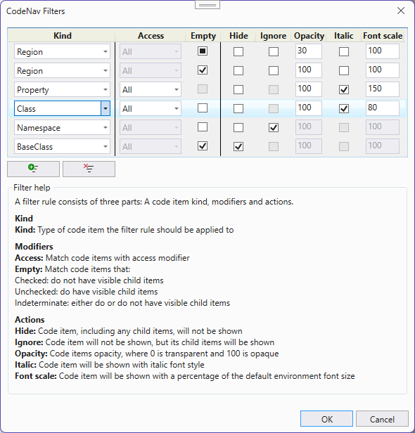

# Filter rules

You can customize how CodeNav shows the code items in a document by creatin filter rules.
A filter rule consists of three parts: A code item kind, modifiers and actions.

## Kind
First select the kind of code item a rule should apply to (classs, method, namespace, etc...).

## Modifiers
Secondly select a number of modifiers to narrow down the rule.

### Access
Match code items by access (public, private, etc...)

### Empty
Match code items that:
- Checked: do not have visible child items
- Unchecked: do have visible child items
- Indeterminate: either do or do not have visible child items

## Action
Finally select then action to should be applied to the code item.

### Hide
Code item, including any child items, will not be shown

### Ignore
Code item will not be shown, but its child items will be shown

### Opacity
Code items will be shown with the selected opacity, where 0 is transparent and 100 is opaque

### Italic
Code items will be shown with italic font style

### Font scale
Code items will be shown with a percentage of the default environment font size  

## Notes
- Not all modifiers and/or actions are available for each kind, the filter dialog will respond and enable the correct list of modifiers