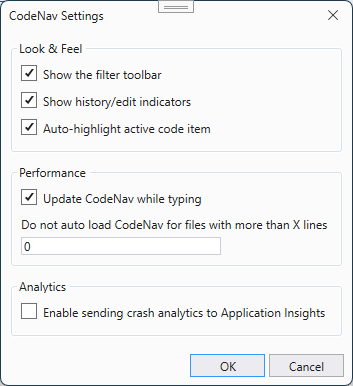

# Settings

**Show the filter toolbar**

Enable or disable the filter toolbar in the CodeNav window

**Show history/edit indicators**

Enable or disable showing which items you have visited in CodeNav

**Auto-highlight active code item**

Enable or disable highlighting the item in CodeNav based on caret position

**Update CodeNav while typing**

Enable of disable updating the list of code items in CodeNav while typing in the text editor

**Do not auto load CodeNav for files with more than X lines**

Disable loading the list of code items in CodeNav for files with more lines than the threshold value