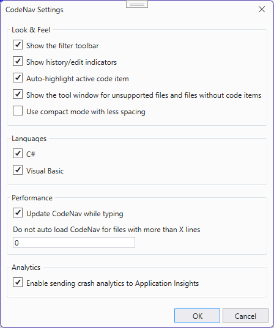

# Settings

## Look & Feel

**Show the filter toolbar**

Enable or disable the filter toolbar in the CodeNav window

**Show history/edit indicators**

Enable or disable showing which items you have visited in CodeNav

**Auto-highlight active code item**

Enable or disable highlighting the item in CodeNav based on caret position

**Show the tool window for unsupported files and files without code items**

Enable or disable showing the CodeNav tool window for unsupported files and files without code items

**Use compact mode with less spacing**

Enable or disable showing items in a condensed form with less vertical spacing optimizing screen real estate

## Languages

**C#**

Enable or disable support for C# code items in CodeNav

**Visual Basic**

Enable or disable support for Visual Basic code items in CodeNav

## Performance

**Update CodeNav while typing**

Enable of disable updating the list of code items in CodeNav while typing in the text editor

**Do not auto load CodeNav for files with more than X lines**

Disable loading the list of code items in CodeNav for files with more lines than the threshold value

## Analytics

**Enable sending crash analytics to Application Insights**

Enable sending logs about exceptions in CodeNav to Application Insights